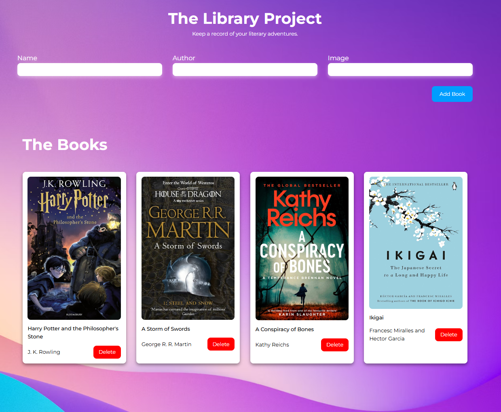

# The Project Library

<p>

</p>

## The Task 

1. All of your book objects are going to be stored in an array, so you’ll need a constructor for books. Then, add a separate function to the script (not inside the constructor) that can take some arguments, create a book from those arguments, and store the new book object into an array. Your code should look something like this (we’re showing only a basic skeleton without function parameters)

### Answer: 

```javascript 
// Array to hold objects
const myLibrary = [];

// Constructor
function Book(title, author, image) {
  this.title = title;
  this.author = author;
  this.image = image;
}

function addBookToLibrary() {
  // take params, create a book then store it in the array

  let nameValue = nameInput.value;
  let authorValue = authorInput.value;
  let imageValue = imageInput.value;

  if (nameValue === "" || authorValue === "" || imageValue === "") {
    alert("Please enter all the correct values")
  }

  let newBook = new Book (nameValue, authorValue, imageValue);
  myLibrary.push(newBook);
  displayBooks();

  nameInput.value = "";
  authorInput.value = "";
  imageInput.value = "";
}
```

2. Write a function that loops through the array and displays each book on the page. You can display them in some sort of table, or each on their own “card”. It might help for now to manually add a few books to your array so you can see the display.

* While it might look easier to manipulate the display of the books directly rather than store their data in an array first, from here forward, you should think of these responsibilities separately. We’ll delve deeper into this concept later, but when developing applications, we want the flexibility to recreate elements (like our library and its books) in various ways using the same underlying data. Therefore, consider the logic for displaying books to the user and the book structures that hold all information as distinct entities. This separation will enhance the maintainability and scalability of your code.

3. Add a “New Book” button that brings up a form allowing users to input the details for the new book and add it to the library: author, title, number of pages, whether it’s been read and anything else you might want. How you decide to display this form is up to you.

### Answer 
```javascript 
function displayBooks() {
  const books = document.querySelector(".book-cards");
  books.innerHTML = "";
  
  myLibrary.forEach((book, index) => {

    let newDiv = document.createElement("div");

    let bookCard = document.createElement("div");
    bookCard.classList.add("book-card");

    let myImage = document.createElement("img");
    myImage.classList.add("book-card__image");
    myImage.src = book.image;

    let myTitle = document.createElement("p");
    myTitle.textContent = book.title;
    myTitle.classList.add("book-card__title");

    let myAuthor = document.createElement("p");
    myAuthor.classList.add("book-card__author");
    myAuthor.textContent = book.author;

    let deleteBtn = document.createElement("button");
    deleteBtn.classList.add("book-card__delete-btn");
    deleteBtn.textContent = "Delete";

    deleteBtn.addEventListener("click", () => {
      myLibrary.splice(index, 1);
      displayBooks(); 
    });

    bookCard.appendChild(myImage);
    bookCard.appendChild(myTitle);

    bookCard.appendChild(newDiv);
    newDiv.appendChild(myAuthor);
    newDiv.appendChild(deleteBtn);

    books.appendChild(bookCard);
  });
}
```

4. Add a button on each book’s display to remove the book from the library.
You will need to associate your DOM elements with the actual book objects in some way. One easy solution is giving them a data-attribute that corresponds to the index of the library array.

### Answer:

```javascript 
    
let deleteBtn = document.createElement("button");
deleteBtn.classList.add("book-card__delete-btn");
deleteBtn.textContent = "Delete";

deleteBtn.addEventListener("click", () => {
    myLibrary.splice(index, 1);
    displayBooks(); 
});

```